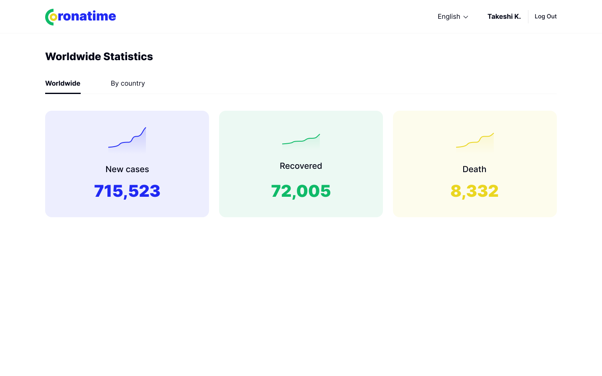
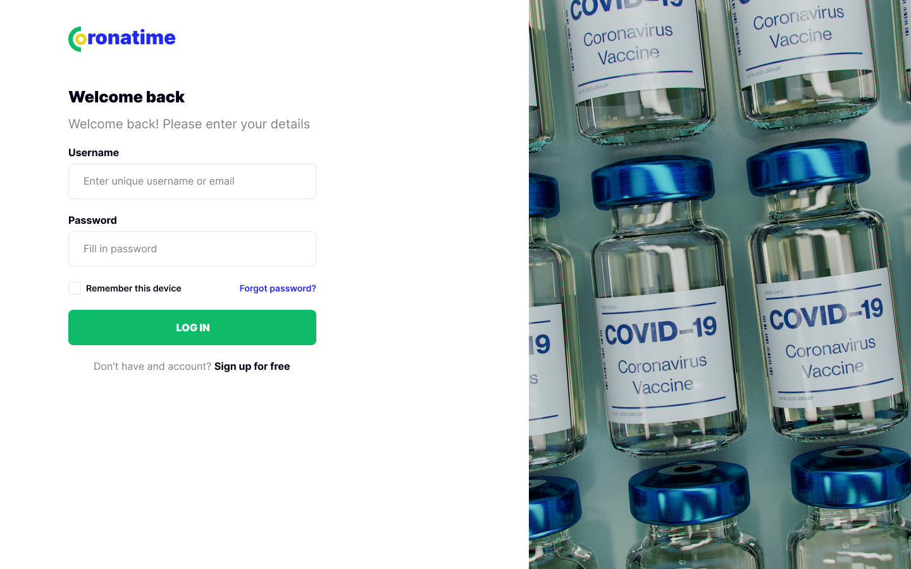

<h1 style="text-align:center;">Coronatime</h1>

Welcome to the Coronatime web-aplication, it is a place where you can see latest worldwide and certain country statistics in two languages(english and georgian). you can search and filter information as you wish. to see this information you have to register an verify your email. 

This app is also used as api for react aplication. you can visit it here -->> link goes here




## Table of Contents

* [Prerequisites](#req)
* [Packages](#packages)
* [Getting Started](#gettingStarted)
* [Resources](#resources)
* [API](#API)


#
<h2 id="req">Prerequisites:</h2>

<table>
    <tr>
        <td>* </td>
        <td>Laravel 8</td>
    </tr>
    <tr>
        <td>* </td>
        <td>PHP 8.0.11</td>
    </tr>
       <tr>
        <td>* </td>
        <td>Livewire 2.8</td>
    </tr>
     <tr>
        <td>* </td>
        <td>laravel/sanctum 2.11</td>
    </tr>
    <tr>
        <td>* </td>
        <td>Sqlite 3</td>
    </tr>
    <tr>
        <td>*</td>
        <td>npm 6.14.15</td>
    </tr>
    <tr>
        <td>* </td>
        <td>composer 2.1.9</td>
    </tr>
</table>

<h2 id="packages">packages:</h2>

<table>
    <tr>
        <td>* </td>
        <td>spatie/laravel-translatable</td>
    </tr>
</table>

<h2 id="gettingStarted">Getting Started</h2>

1\. First of all you need to clone Movie Quote repository from github:
```sh
git clone https://github.com/RedberryInternship/davitchanturia-coronatime.git
```
2\. Next step requires you to run *composer install* in order to install all the dependencies.
```sh
composer install

3\. Now we need to set our env file. Go to the root of your project and execute this command.
```sh
cp .env.example .env
```

And now you should provide **.env** file all the necessary environment variables. All you need here is DB_CONNECTION :
```sh
DB_CONNECTION=sqlite

MAIL_MAILER=smtp
MAIL_HOST=smtp.mailtrap.io
MAIL_PORT=587
MAIL_USERNAME=61c7f9de772974
MAIL_PASSWORD=98dc03231cbb51
MAIL_ENCRYPTION=tls
MAIL_FROM_ADDRESS=coronatime@test.com
MAIL_FROM_NAME="${APP_NAME}"
```
* For using this aplication as API you should provid sanctum variables: 
```sh
SANCTUM_STATEFUL_DOMAINS=localhost:3000,localhost:3002,localhost:8000,127.0.0.1:3002,127.0.0.1:3000,127.0.0.1:8000
FRONT_ADDRESS_CONFIRMED=http://localhost:3000/confirmed
SESSION_DOMAIN=localhost
```

4\. Now execute in the root of you project following:
```sh
  php artisan key:generate
```
Which generates auth key.


5\. Make MYSQL database user and connect to this projects, then you can execute the commands: 
```sh
  php artisan migrate
  php artisan db:seed
```

6\. You also need to make a storage link for the images with the command, mentioned below and change the FILESYSTEM_DRIVER to public in your .env file:
```sh
  php artisan storage:link
  FILESYSTEM_DRIVER=local
```
8\. Then install translatable package
```sh
composer require spatie/laravel-translatable
```
<h2 id="API">API:</h2>

For API specifications you can visit aplication's Swager documentation.